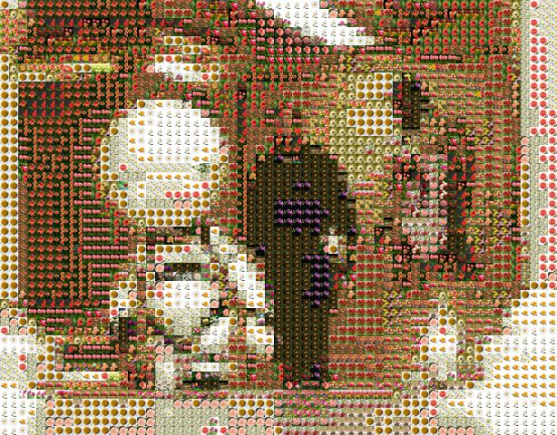

# photoMosaic

Imagine having a pixelated image but with each pixel as its own customized image. You can have your own photos as the database and use them as the mosaic items.
This tool uses `pillow` and `numpy` for working with the image pixel data.

- calculates the mean color of the entire image in the database.
- caches all the mean values to be used later.
- divides the input image into blocks and replaces the block with the image with the closest image.

## Usage

1. Move your custom database to `assets/<name>` folder.
2. Run the `crop.py` file to crop all the images in the database.
3. Run the `cache.py` to cache the mean for all the images.
4. Run the `photoMosaic.py` to generate the final output.

## Example

|    original    |        mosaic      |
|----------------|--------------------|
|||

> “It gives me a headache just trying to think down to your level.” 
> \- marvin the depressed android

## credits

This project was made following the blog by Robert Heaton.
Follow his blog [here](https://robertheaton.com/2018/11/03/programming-project-4-photomosaics/).

 Technical details 

1. `crop.py`:
    - Crops the images in the assets/flowers folder and stores it in the assets/src folder.
    - This helps in stitching the final image.
    - Use any customized database in its place.

2. `cache.py`:
    - Calculates the mean color in rgb for all the images in assets/src and caches it into `cache.json`.
    - This makes it so that the entire mean of the database is not need to be generated for each image.

3. `photoMosaic.py`:
    - `avg(image, block_size)` 
        - divides the image np array into blocks (`np.reshape()`) and calculates the average for each of the blocks.
        - returns a pixelated array for the image. The pixels will be replaces later.

    - `mosaic(pixelated_array)`
        - converts the pixelated image into a grid with image names whose mean is closest to the corresponding block in the pixelated image.
    
    - `assembler(mosaicPhotos, size)`
        - takes the grid of names of photos and stitches all the images together so that the final image is the photo mosaic.
        - resizes the image to the original size so as to maintain continuity.

